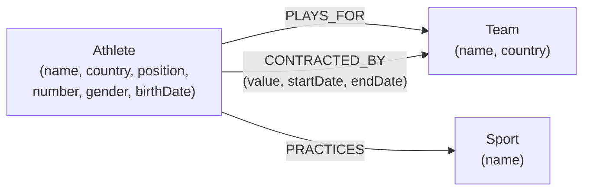

# Sports Data API with Neo4j

A Node.js REST API backed by a **Neo4j** graph database to manage athletes, teams, sports and contracts. Built as the final project for the Data Storage (NoSQL) course at university.

## Highlights

- Modelled a sports domain as a **property graph** — a natural fit for the many-to-many relationships between athletes, teams and sports.
- Optimised graph queries for a **~40% improvement in query efficiency** over the initial design.
- Exposed CRUD operations over a clean REST API (Node.js + Neo4j driver).

## Data model



**Nodes**
- **Athlete** — name, country, position, number, gender, birthDate.
- **Team** — name, country.
- **Sport** — name.

**Relationships**
- **PLAYS_FOR** — connects an athlete to a team.
- **PRACTICES** — connects an athlete to a sport.
- **CONTRACTED_BY** — connects an athlete to a team, with `value`, `startDate` and `endDate`.

## Database initialisation

1. **Start Neo4j** (Neo4j Desktop or as a service):

   ```sh
   neo4j start
   ```

2. **Open the Neo4j Browser** at `http://localhost:7474` and log in.

3. **Create the schema and seed data** with Cypher:

   ```cypher
   // Athletes
   CREATE (a1:Athlete {name: 'John Doe', country: 'UK', position: 'Forward', number: 10, gender: 'Male', birthDate: '1990-01-01'})
   CREATE (a2:Athlete {name: 'Jane Smith', country: 'Canada', position: 'Guard', number: 12, gender: 'Female', birthDate: '1992-02-02'})
   CREATE (a3:Athlete {name: 'Carlos Ruiz', country: 'Spain', position: 'Midfielder', number: 8, gender: 'Male', birthDate: '1988-03-03'})

   // Teams
   CREATE (t1:Team {name: 'Lakers', country: 'UK'})
   CREATE (t2:Team {name: 'Raptors', country: 'Canada'})
   CREATE (t3:Team {name: 'Barcelona', country: 'Spain'})

   // Sports
   CREATE (s1:Sport {name: 'Basketball'})
   CREATE (s2:Sport {name: 'Football'})

   // Athlete → Team
   MATCH (a1:Athlete {name: 'John Doe'}), (t1:Team {name: 'Lakers'})    CREATE (a1)-[:PLAYS_FOR]->(t1)
   MATCH (a2:Athlete {name: 'Jane Smith'}), (t2:Team {name: 'Raptors'}) CREATE (a2)-[:PLAYS_FOR]->(t2)
   MATCH (a3:Athlete {name: 'Carlos Ruiz'}), (t3:Team {name: 'Barcelona'}) CREATE (a3)-[:PLAYS_FOR]->(t3)

   // Athlete → Sport
   MATCH (a1:Athlete {name: 'John Doe'}), (s1:Sport {name: 'Basketball'})  CREATE (a1)-[:PRACTICES]->(s1)
   MATCH (a2:Athlete {name: 'Jane Smith'}), (s1:Sport {name: 'Basketball'}) CREATE (a2)-[:PRACTICES]->(s1)
   MATCH (a3:Athlete {name: 'Carlos Ruiz'}), (s2:Sport {name: 'Football'})  CREATE (a3)-[:PRACTICES]->(s2)

   // Contracts
   MATCH (a1:Athlete {name: 'John Doe'}), (t1:Team {name: 'Lakers'})    CREATE (a1)-[:CONTRACTED_BY {value: 2000000, startDate: '2022-01-01', endDate: '2023-01-01'}]->(t1)
   MATCH (a2:Athlete {name: 'Jane Smith'}), (t2:Team {name: 'Raptors'}) CREATE (a2)-[:CONTRACTED_BY {value: 1500000, startDate: '2022-02-01', endDate: '2023-02-01'}]->(t2)
   MATCH (a3:Athlete {name: 'Carlos Ruiz'}), (t3:Team {name: 'Barcelona'}) CREATE (a3)-[:CONTRACTED_BY {value: 3000000, startDate: '2022-03-01', endDate: '2023-03-01'}]->(t3)
   ```

## Running the API

1. **Clone** the repository:

   ```sh
   git clone https://github.com/SEBASBELMOS/Sports_Data_API_with_Neo4j.git
   ```

2. **Install dependencies**:

   ```sh
   cd Sports_Data_API_with_Neo4j
   npm install
   ```

3. **Set environment variables** in a `.env` file:

   ```env
   NEO4J_URI=bolt://localhost:7687
   NEO4J_USER=neo4j
   NEO4J_PASSWORD=<your-neo4j-password>
   PORT=8080
   ```

4. **Start** the app:

   ```sh
   npm start
   ```

The API runs at `http://localhost:8080`. Use Postman or cURL to interact with the endpoints.

## Tech

Node.js · Neo4j · Cypher · REST · NoSQL

> Academic project developed for educational purposes — demonstrates building a RESTful API over a graph database and modelling athletes, teams, sports and contracts.
